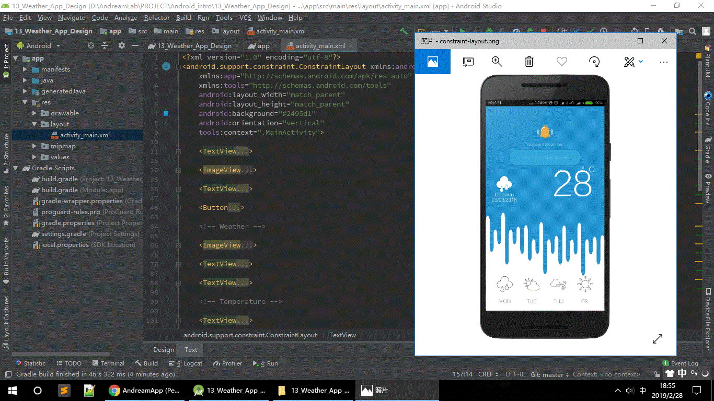

## Weather application

The layout of this application is based on the use of a LinearLayout. 

Redesign the same application using a constraint-layout.

Read more at https://developer.android.com/training/constraint-layout


## Assign 02

Redesigned snapshot:



Most used attributes:

```xml
app:layout_constraintLeft_toLeftOf
app:layout_constraintLeft_toRightOf
app:layout_constraintRight_toLeftOf
app:layout_constraintRight_toRightOf
app:layout_constraintTop_toTopOf
app:layout_constraintTop_toBottomOf
app:layout_constraintBottom_toTopOf
app:layout_constraintBottom_toBottomOf
android:padding
android:layout_margin
```

Other attributes in `ConstraintLayout`:

```xml
app:layout_constraintBaseline_toBaselineOf
app:layout_constraintDimensionRatio

app:layout_constraintHorizontal_chainStyle
app:layout_constraintHorizontal_weight

app:layout_constraintHorizontal_bias
app:layout_constraintVertical_bias
```

References:

[https://blog.csdn.net/lmj623565791/article/details/78011599](https://blog.csdn.net/lmj623565791/article/details/78011599)
